# 大模型运行环境配置

[toc]


## 0. VSCode配置远程连接

安装 `VSCode` 中的`Remote-SSH` 扩展，修改`ssh` 配置文件（可以在 VSCode 中打开新页面，然后 `ctrl`+`shift`+`p` 选择连接到主机）

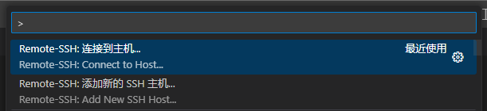

选择“连接到主机”，可以看到已经连接过的主机以及添加和配置两个选项。

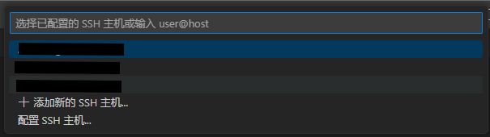

可以“+添加新的 SSH 主机“，然后输入 按照提示格式输入`ssh <User>@<HostName>:<Port> -<Host>` 建立新的连接。

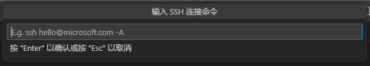

新建完成后就会在配置文件中出现相应的内容，格式如下。如果要修改连接的名称，修改 `<Host>` 即可。

```bash
Host <Host>
  HostName <HostName>
  User <User>
  Port <Port>
```

然后打开，输入密码即可。


## 1. Anaconda

### 1.1 下载并在本地配置 Anaconda

从[官网](https://www.anaconda.com/download/success) 下载最新的 Anaconda3，选择相应 Linux 版本，在指定目录下使用 `wget` 进行下载。可以根据需求下载 Anaconda 或者 Miniconda。

```bash
# /bin/bash
wget https://repo.anaconda.com/archive/Anaconda3-2024.10-1-Linux-x86_64.sh # Anaconda
bash Anaconda3-2024.10-1-Linux-x86_64.sh
```

Miniconda

```bash
# /bin/bash
wget https://repo.anaconda.com/miniconda/Miniconda3-latest-Linux-x86_64.sh # Miniconda
bash Miniconda3-latest-Linux-x86_64.sh
```

运行脚本后，会出现用户协议的阅读，一直回车到出现 “yes” or "no" 的选项。可以在输入 yes 后的提示框中输入具体路径并用回车安装（必须是空路径）。直接回车就是默认路径。

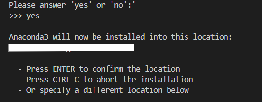

安装完选择是否用 conda 环境初始化，即用 conda base 环境替换 `$SHELL`。仅修改当前权限下的 `.bashrc`。输入 yes，再次打开命令行的时候最前面就会有一个 `(base)`。

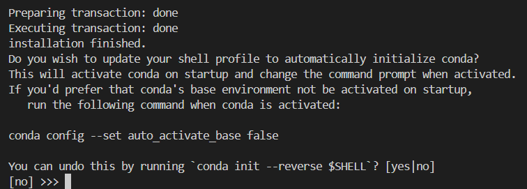

 输入`conda --version` 检查安装是否成功。

```bash
conda --version
# reply
conda 24.9.2
```

**添加镜像**

在安装路径下的`.condarc` 文件中添加相应的镜像。

```yaml
channels:
 - defaults
show_channel_urls: true
channel_alias: https://mirrors.tuna.tsinghua.edu.cn/anaconda
default_channels:
 - https://mirrors.tuna.tsinghua.edu.cn/anaconda/pkgs/main
 - https://mirrors.tuna.tsinghua.edu.cn/anaconda/pkgs/free
 - https://mirrors.tuna.tsinghua.edu.cn/anaconda/pkgs/r
 - https://mirrors.tuna.tsinghua.edu.cn/anaconda/pkgs/pro
 - https://mirrors.tuna.tsinghua.edu.cn/anaconda/pkgs/msys2
custom_channels:
 pytorch: https://mirrors.tuna.tsinghua.edu.cn/anaconda/cloud
```


### 1.2. 新建 Conda 环境

以 LLaVA 为例，新建专属 conda 环境。`-n` 指定环境名称，`python=3.x` 指定 python 版本， `-y` 表示同意安装过程中所有选项，用于快捷安装。

```bash
conda create -n llava python=3.10 -y
```

安装完后可以检查是否安装成功。

```bash
conda env list # 检查环境列表
conda activate llava # 如果环境存在，则激活
```

之后`(base)` 就会被替换成指定的环境名称，在 Anaconda 中，系统会默认在虚拟环境汇总下载好一些需要的库，可以直接用 pip 下载。使用`pip show pip` 检查 `pip` 路径，确保下载到当前环境中。如果 `which pip` 显示的不是当前环境的位置，那么需要考虑修改环境变量等内容。（可能是在系统下安装了 python，需要注释掉 `.pyenv` 等）

```
Name: pip
Version: 24.2
Summary: The PyPA recommended tool for installing Python packages.
Home-page: https://pip.pypa.io/
Author: 
Author-email: The pip developers <distutils-sig@python.org>
License: MIT
Location: /path/to/your/anaconda3/envs/llavaOV/lib/python3.10/site-packages
Requires: 
Required-by: 
```


## 2. 配置CUDA、CUDNN

CUDA 是用于并行计算，和 GPU 加速的计算平台和编程模型。cuDNN 主要用于深度神经网络（DNN）的训练和推理，提供了高性能的基本操作和优化，以加速深度学习任务。

### 2.1. 下载并配置 cuda

使用 `nvidia-smi` 和 `nvcc -V` 检查 cuda 版本是否一致。在 `nvidia-smi` 中，通过 `CUDA Version: ` 查看当前的 cuda 版本；在 `nvcc -V` 中可以在 `Cuda compilation tools, release` 后面查看 cuda 编辑器版本。发现版本不匹配。

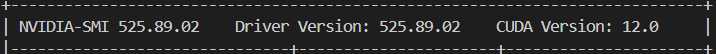

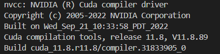

从 CUDA Toolkit Archive （[官网链接](https://developer.nvidia.com/cuda-toolkit-archive)）下载相应的 CUDA Toolkit。根据电脑配置选择（操作系统、结构、分布、系统版本以及安装器类型）根据固定指令下载。以 Ubuntu 18.04 为例，进入 cuda 下载目录，运行以下命令：

```bash
wget https://developer.download.nvidia.com/compute/cuda/11.8.0/local_installers/cuda_11.8.0_520.61.05_linux.run  # 从互联网上下载 cuda 安装器
bash cuda_11.8.0_520.61.05_linux.run  # 运行安装程序
```

运行安装程序，如果没有出现错误信息，等待一会会跳出用户协议，输入 accept 继续。

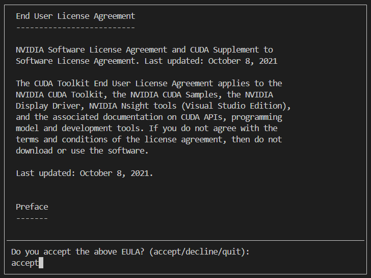

下一步，去掉驱动器（Driver）前面的√，不更新驱动。

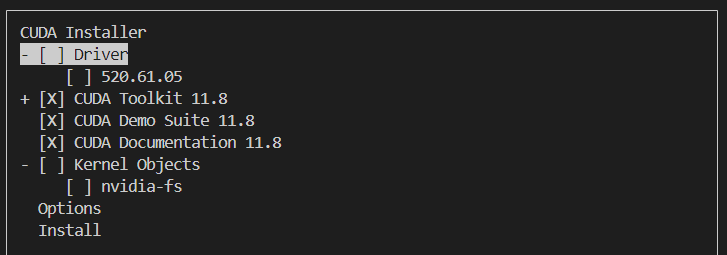

出现权限问题，因为不是 rooter，所以无法在 `/usr/local/cuda-11.8` 安装 cuda，需要修改安装目录以及环境。

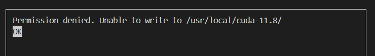

```bash
sh cuda_11.8.0_520.61.05_linux.run --installpath=path/to/your/cuda-11.8
```

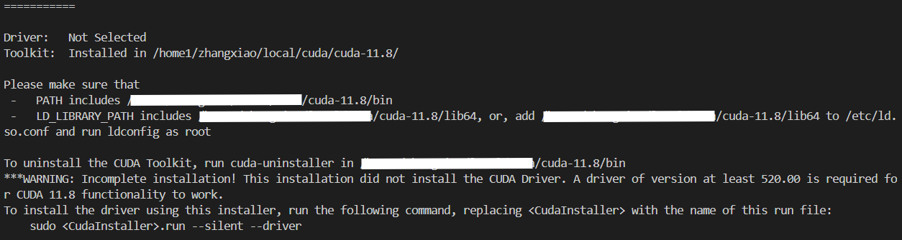

安装完成，根据提示添加环境变量。以下是命令：

```bash
# add PATH & LD_LIBRARY_PATH
export CUDA_HOME=/home1/zhangxiao/local/cuda/cuda-11.8
export PATH=$CUDA_HOME/bin:$PATH
export LD_LIBRARY_PATH=$CUDA_HOME/lib64:$LD_LIBRARY_PATH
export PATH=$CUDA_HOME/lib64:$PATH

# uninstall CUDA Toolkit
cuda-11.8/bin/cuda-uninstaller
```


### 2.2. 下载并配置 cuDNN

cuDNN 下载网址（[网页链接](https://developer.nvidia.com/rdp/cudnn-archive)），选择与 cuda 匹配的版本进行下载。下载 cuDNN 需要用邮箱在NVIDIA官网（[官网链接](https://developer.nvidia.com/login)）注册一个账户。如果直接使用 `wget` 下载会得到一个 `index.html` 文件。因此在本地下载后通过 Remote SSH 传入服务器。

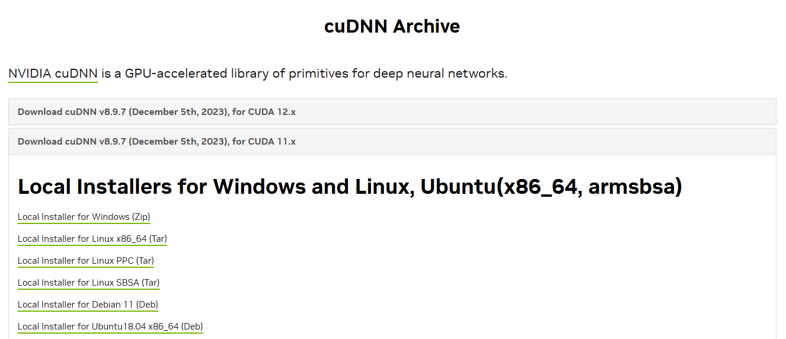

成功上传服务器后解压文件。

```bash
# in your upload path
unxz cudnn-linux-x86_64-8.9.7.29_cuda11-archive.tar.xz # remove xz
tar -xvf cudnn-linux-x86_64-8.9.7.29_cuda11-archive.tar.xz # unzip
```

解压完成后会得到相应的文件夹。

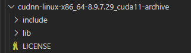

安装好之后将对应的 cudnn 文件加入 cuda 文件夹中即可插入使用。

```bash
cp include/cudnn*.h /home1/zhangxiao/local/cuda/cuda-11.8/include/
cp lib/libcudnn* /home1/zhangxiao/local/cuda/cuda-11.8/lib64
chmod a+r /home1/zhangxiao/local/cuda/cuda-11.8/include/cudnn*.h /home1/zhangxiao/local/cuda/cuda-11.8/lib64/libcudnn*
```

输入以下命令检查是否成功安装 cudnn。

```bash
cat /home1/zhangxiao/local/cuda/cuda-11.8/include/cudnn_version.h | grep CUDNN_MAJOR -A 2 
```

输出结果，可以看到 CUDNN，说明已经成功安装 cudnn。

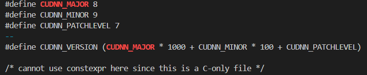


## 3. 配置 git

配置一些基本信息

```bash
git config --global user.name <your name>
git config --global user.email <your email>
git config --list
```

生成密钥，在 *Enter file in which to save the key* 后面添加保存的密钥，会在对应路径下生成一个 `id_rsa` 文件和一个 `id_rsa.pub` 文件。添加完毕后会输出保存的位置。

```bash
# generate private keys
ssh-keygen -t rsa
```

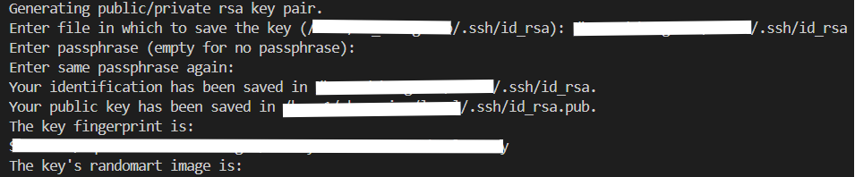

将 `id_rsa.pub` 中的内容复制到 `github` 个人主页（`https://github.com/settings/profile`）然后在 access 中找到 *SSH and GPG keys*。

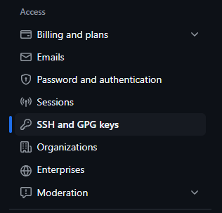

通过在 SSH keys 中 添加新的 SSH key，将`id_rsa.pub` 中的内容粘贴进去然后保存即可。

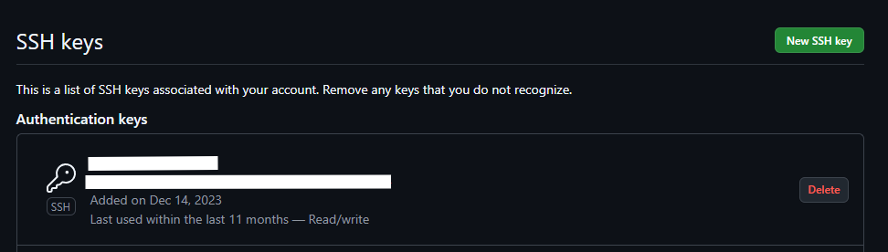

以 `llava-next` 为例，使用 `git@` 似乎会遇到一点问题。

```bash
git clone https://github.com/LLaVA-VL/LLaVA-NeXT.git
```


## 4. 配置 git-lfs

用于从 hugging face 上下载模型权重及其他文件。

从 [git-lfs github 仓库](https://github.com/git-lfs/git-lfs/releases) 选择合适的版本下载压缩包（`.tar.gz` 文件）并解压到指定位置。（以`v3.5.1`为例）

```bash
# /bin/bash
cd path/to/your/dir
wget https://github.com/git-lfs/git-lfs/releases/download/v3.5.1/git-lfs-linux-amd64-v3.5.1.tar.gz
tar -zx git-lfs-linux-amd64-v3.5.1.tar.gz
```

解压后得到一个对应版本的文件夹，里面有个 `install.sh`，是将 `git-lfs` 命令下载到`/usr/local` 中，在文件中修改 `prefix` 变量可以修改下载路径，将 `git-lfs` 下载到指定位置。之前使用 `git lfs install` 一直找不到命令是因为没有将自定义后的 `prefix` 这个位置加入环境变量导致系统无法找到，修改 `~/.bashrc` 可以解决这个问题。

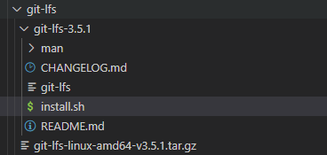

```bash
# export PATH
export PATH=$PATH:/path/to/your/lfs/bin
# initialize git-lfs
git lfs install
# system response
Git LFS initialized.
```


